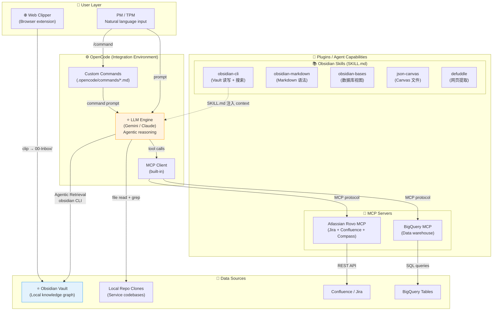
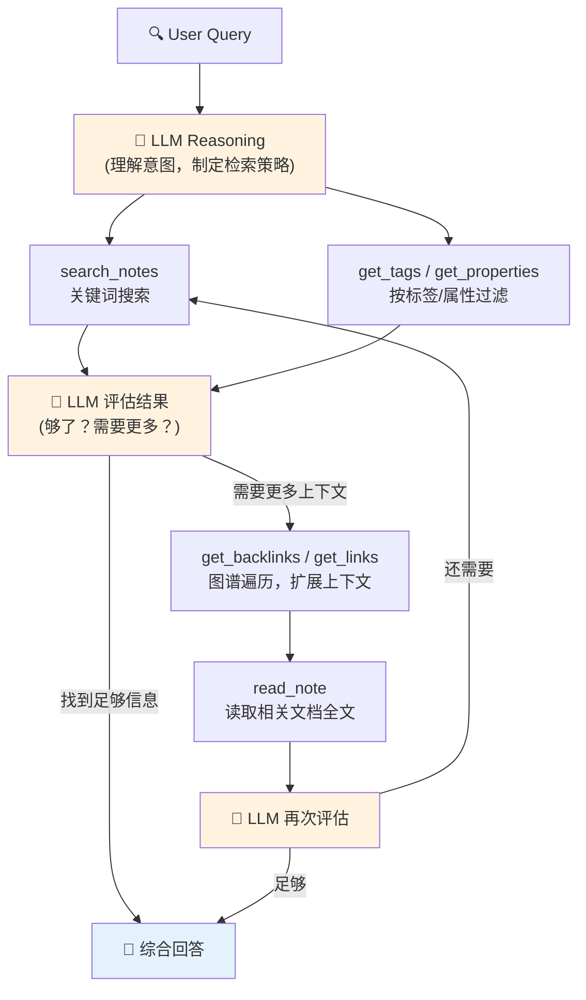
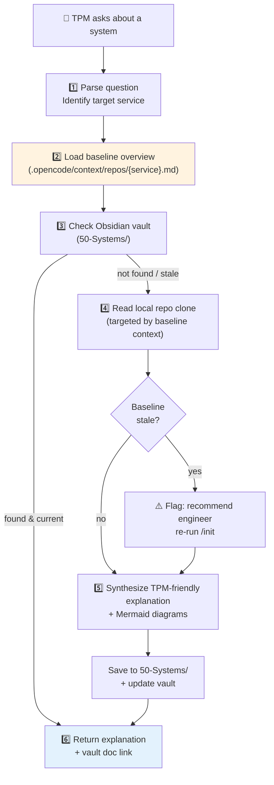
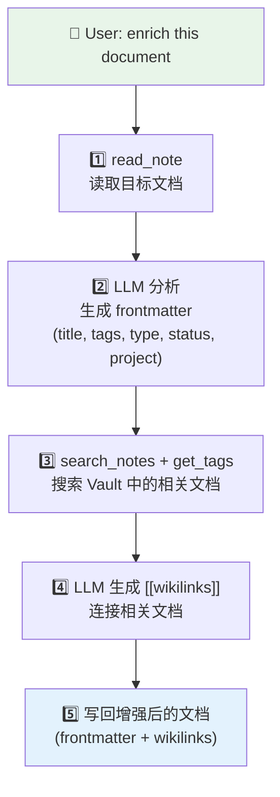
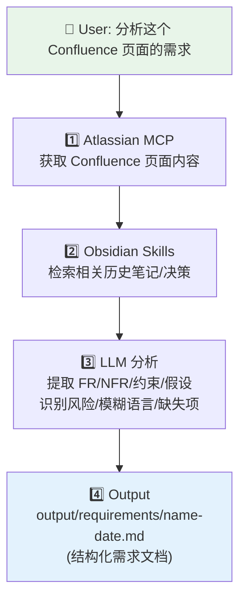
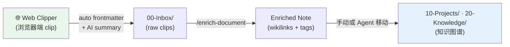
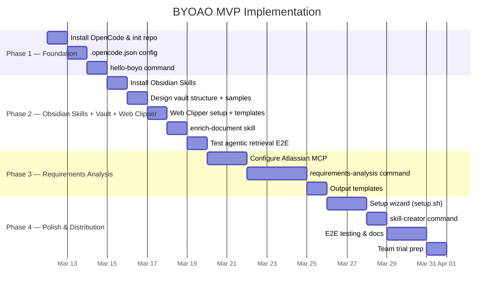

# BYOAO MVP — Architecture & Implementation Plan

> [!abstract] What is BYOAO?
> **BYOAO** (==Build Your Own AI OS==) 是一个本地优先的 AI 办公助手系统，让 PM/TPM 通过自然语言完成需求分析、状态报告、风险识别等日常任务。
>
> **核心价值**: 把分散在 Confluence、BigQuery、Obsidian 中的信息，通过 AI Agent 统一调度，降低 PM/TPM 的信息获取和文档生产成本。

---

## High-Level Architecture



> [!info] Agentic Retrieval via Obsidian Skills
> BYOAO 不使用传统 RAG pipeline（无 vector DB、无 embeddings）。Agent 通过 [Obsidian Skills](https://github.com/kepano/obsidian-skills)（SKILL.md 格式）获得 Obsidian CLI 能力，进行多轮迭代检索。LLM 本身就是语义理解层。详见 [[#Agentic Retrieval Strategy]]。
>
> Obsidian Skills 是 Obsidian 官方维护的 Agent Skills 集合，提供 5 个 skills：`obsidian-cli`、`obsidian-markdown`、`obsidian-bases`、`json-canvas`、`defuddle`。无需自建 MCP server。

> [!tip] Interactive Architecture Map
> For a visual, drag-and-drop view of the architecture, open the canvas:
> ![[BYOAO-Architecture.canvas]]

### Key Components

| Component | Role | Tech Choice |
|-----------|------|-------------|
| **OpenCode** | Integration env — TUI, model routing, MCP client, command system | Go binary, open-source |
| **Custom Commands** | Skills/workflows — 可插拔的任务模块 | `.opencode/commands/*.md` |
| **Obsidian Skills** | Agent 的 Obsidian 能力层 — CLI 操作、Markdown 语法、Canvas、Bases | [kepano/obsidian-skills](https://github.com/kepano/obsidian-skills) (SKILL.md) |
| **Atlassian MCP** | Confluence/Jira/Compass 数据接入 | [Atlassian Rovo MCP](https://github.com/atlassian/atlassian-mcp-server) (official) — cloud-hosted, OAuth 2.1 |
| **BigQuery MCP** | 数据仓库查询 | Existing MCP server |
| **Obsidian Vault** | PM/TPM 知识图谱存储 — documents as graph nodes | Local markdown + frontmatter + wikilinks |
| **Obsidian Web Clipper** | 浏览器端信息捕获 — 网页/Confluence/Jira → Vault | Browser extension + custom templates + AI Interpreter |

---

## Key Corrections from Research

> [!warning] Config & Skills Format Corrections
> 原始计划中有几处需要修正：
>
> | Original Assumption | Actual Finding | Impact |
> |---------------------|----------------|--------|
> | Config: `opencode.json` | 应为 ==`.opencode.json`== (dot prefix) | Config filename change |
> | Skills: `.opencode/skills/SKILL.md` | OpenCode 用 ==Custom Commands==: `.opencode/commands/*.md` | Skills 格式需调整 |
> | SKILL.md 是 OpenCode 原生 | SKILL.md 是 Claude Code/Cursor 格式，==非 OpenCode 原生== | 需决定用哪种格式 |

> [!question] Decision Needed: Skill Format Strategy
> **Option A — OpenCode Custom Commands (推荐)**
> - 格式: `.opencode/commands/skill-name.md`
> - 调用: 在 OpenCode TUI 中输入 `/skill-name`
> - 优点: 原生支持，无需额外集成
> - 缺点: 格式较简单，没有 frontmatter/trigger 机制
>
> **Option B — Dual Format**
> - 同时维护 OpenCode commands + SKILL.md
> - 优点: 跨平台兼容 (Claude Code, Cursor 也能用)
> - 缺点: 维护成本翻倍
>
> **Option C — SKILL.md Only + 手动加载**
> - 保持 SKILL.md 格式，通过 system prompt / context 注入
> - 优点: 格式更丰富（frontmatter, triggers, dependencies）
> - 缺点: 不是 OpenCode 原生，需要 workaround

---

## Obsidian Vault Structure

> [!info] Documents as Graph Nodes
> Vault 的核心设计理念是 **documents as graph nodes**，而非传统的文件夹层级。每个文档通过 frontmatter（category, tags, attributes, relations）和 `[[wikilinks]]` 构成知识图谱。Agent 通过遍历这个图谱来理解 PM 的知识结构和意图。
>
> 文件夹仅用于粗粒度分类，真正的组织关系通过 wikilinks 和 metadata 表达。

PM/TPM 知识库的推荐目录结构：

```
BYOAO-Vault/
├── 00-Inbox/              # 快速笔记、meeting notes、Web Clipper clips 落地点
├── 10-Projects/           # 按项目组织
│   └── ProjectName/
│       ├── requirements.md
│       ├── risks.md
│       └── decisions.md
├── 20-Knowledge/          # PM 方法论、模板
│   ├── frameworks/
│   └── templates/
├── 30-People/             # 联系人、团队信息
├── 40-Archive/            # 归档项目
├── 50-Systems/            # Code-derived system knowledge (auto-generated by system-explainer)
│   ├── service-name/
│   │   ├── overview.md
│   │   └── workflow.md
│   └── ...
└── _templates/            # Obsidian 模板文件
```

> [!example] Document Frontmatter Example
> 每个文档应包含 frontmatter 以支持 Agent 的 metadata 检索：
> ```yaml
> ---
> title: Q1 Risk Review
> type: meeting-notes
> project: "[[ProjectAlpha]]"
> status: active
> tags: [risk, quarterly-review]
> participants: [Alice, Bob]
> date: 2026-03-10
> ---
> ```
> `[[wikilinks]]` 在正文中连接相关文档，形成可遍历的知识图谱。
> 用户可以手动添加 frontmatter，也可以使用 `enrich-document` Skill 自动生成。

---

## Obsidian Skills Overview

### Skills from [kepano/obsidian-skills](https://github.com/kepano/obsidian-skills)

| Skill | Purpose | Key Capabilities |
|-------|---------|-----------------|
| **obsidian-cli** | Vault 读写、搜索、图谱遍历 | search, backlinks, links, read, create, properties, tags |
| **obsidian-markdown** | Obsidian Flavored Markdown 语法指导 | wikilinks, callouts, embeds, frontmatter, tags |
| **obsidian-bases** | Obsidian Bases 数据库视图 | .base 文件、filters, formulas, views |
| **json-canvas** | JSON Canvas 文件操作 | nodes, edges, groups, .canvas 文件 |
| **defuddle** | 网页内容提取为 clean markdown | 去除导航/广告等干扰，保留核心内容 |

### Installation

```bash
# OpenCode
git clone https://github.com/kepano/obsidian-skills.git ~/.opencode/skills/obsidian-skills/

# Claude Code
# Copy skills/ contents to /.claude/

# Codex CLI
# Copy to ~/.codex/skills/
```

### Obsidian CLI Capabilities (via obsidian-cli skill)

Agent 通过 `obsidian-cli` skill 调用以下 CLI 能力：

| Category | CLI Commands | Agent Use Case |
|----------|-------------|----------------|
| **Search** | `search`, `search:context` | 关键词搜索 + 上下文片段 |
| **Graph** | `backlinks`, `links`, `orphans`, `deadends` | 知识图谱遍历、找到相关文档、发现孤立节点 |
| **Metadata** | `properties`, `property:read`, `property:set`, `tags`, `tag:files` | 按属性/标签检索、更新文档元数据 |
| **File Ops** | `read`, `create`, `append`, `prepend`, `outline` | 读写文档、获取文档结构 |
| **Dev** | `eval` | 执行 JS 代码（高级场景） |

> [!note] Obsidian Desktop Required
> CLI 需要 Obsidian 桌面应用运行中。对 PM/TPM 用户来说这是正常状态。对工程师（使用 IDE）有 OpenCode 内建的 file read + grep 作为 fallback。

---

## Agentic Retrieval Strategy

### Why No RAG for MVP

传统 RAG pipeline 需要 vector DB、embedding 模型、chunking 策略、BM25 索引等大量基础设施。BYOAO MVP 采用 **Agentic Retrieval** 方法，彻底消除这些复杂性：

| Aspect | Traditional RAG | Agentic Retrieval (BYOAO) |
|--------|----------------|--------------------------|
| 语义理解 | Embedding model (offline) | LLM 本身（实时推理） |
| 检索方式 | Single-shot query → ranked chunks | Multi-round iterative search |
| 知识结构 | Flat chunk index | Obsidian 知识图谱（backlinks, tags, properties） |
| 基础设施 | sqlite-vec + BGE + BM25 | Obsidian Skills (zero infra, pre-built) |
| 维护成本 | 索引管道、chunk 策略调优 | 无 — Vault 就是数据 |

### How It Works



### Obsidian CLI vs Plain Grep

Agentic Retrieval 的关键优势在于 Obsidian CLI 提供的结构化能力远超 plain file read + grep：

- **Graph traversal**: `backlinks` / `links` 让 Agent 沿知识图谱探索，发现 grep 无法找到的隐式关联
- **Metadata queries**: `tags` / `properties` 支持按类型、状态、项目等维度过滤，无需全文搜索
- **Structural awareness**: `outline` 提供文档结构，Agent 可以精准定位到特定章节
- **Context search**: `search:context` 返回匹配行的上下文，比 raw grep 更有用

> [!tip] Future Optimization
> 如果 Vault 增长到数千篇文档，CLI 搜索性能不足时，可以引入 vector search 作为优化层。但 MVP 阶段完全不需要。

---

## Obsidian Integration: Skills vs Custom MCP

> [!success] Decision: Use Obsidian Skills (No Custom MCP Server)
> [kepano/obsidian-skills](https://github.com/kepano/obsidian-skills) 已经提供了完整的 Obsidian Agent 能力，无需自建 MCP server。
>
> | Approach | Effort | Maintenance | Coverage |
> |----------|--------|-------------|----------|
> | ~~自建 Obsidian CLI MCP Server~~ | ~3 days coding | 需自行维护 | CLI wrapper only |
> | **Obsidian Skills (adopted)** | Install only | Obsidian 官方维护 | CLI + Markdown + Bases + Canvas + Defuddle |
>
> Skills 通过 SKILL.md 注入 Agent context，Agent 直接调用 `obsidian` CLI 命令。无中间层、无额外进程、无依赖。

---

## Codebase Knowledge Layer

> [!success] Decision: CLAUDE.md as Baseline + OpenCode Live Read
> 工程师用 Claude Code `/init` 为每个 repo 生成 CLAUDE.md（包含架构、关键路径、约定、依赖），作为 **baseline context** 存入 `.opencode/context/repos/`。`system-explainer` 优先读取 baseline，需要细节时再读 local repo clone。
>
> | Layer | Source | 生成方 | 更新频率 |
> |-------|--------|--------|---------|
> | Baseline Overview | CLAUDE.md (via `/init`) | 工程师 | 重大功能/重构后 |
> | Live Code Access | Local repo clone + file read/grep | Agent 自动 | 实时 |
> | Knowledge Cache | Obsidian `50-Systems/` | Agent 自动 | 按需 |

### Baseline Overview 管理

**初始生成**：工程师在 repo 根目录运行 `claude /init`，将生成的 CLAUDE.md 内容复制到：
```
.opencode/context/repos/{service-name}.md
```

**Repo 注册**：在 `.opencode/context/repos/_index.md` 维护索引：
```markdown
| Repo | Path | Description | Overview Updated |
|------|------|-------------|-----------------|
| payment-service | ~/repos/payment-service | Payment processing | 2026-03-12 |
```

**更新策略 (MVP)**：
- 工程师在重大功能/重构后手动重跑 `/init` 并更新对应文件
- `system-explainer` 发现 baseline 与实际代码不一致时，主动提醒："baseline overview may be stale, consider re-running `/init`"
- 未来可考虑 CI 自动化（merge to main 时自动生成）

### System Explainer Workflow



---

## Skills (Custom Commands)

### MVP Skills

| Skill | Purpose | Dependencies |
|-------|---------|-------------|
| `hello-boyo` | 系统状态检查 + greeting | None |
| `requirements-analysis` | 从 Confluence 提取结构化需求 | Atlassian MCP + Obsidian Skills |
| `data-analysis` | BigQuery 数据查询 + 分析 | BigQuery MCP + Obsidian Skills |
| `enrich-document` | 自动为文档添加 frontmatter + wikilinks | Obsidian Skills (`obsidian-cli`) |
| `system-explainer` | 解释代码系统/工作流 (baseline + live code + cache) | Local Repos + Baseline Overviews + Obsidian Skills |
| `skill-creator` | 通过对话创建新 skill | None |

### Enrich Document Workflow



> [!info] Manual Enrichment
> 用户也可以手动添加 frontmatter 和 wikilinks。`enrich-document` 只是加速这个过程，帮助用户养成知识图谱维护习惯。

### Requirements Analysis Workflow



---

## Web Clipper — 浏览器端信息捕获

> [!success] Decision: Web Clipper 作为 Human-Initiated Capture Channel
> [Obsidian Web Clipper](https://obsidian.md/clipper) 是浏览器扩展，TPM 浏览网页/内部工具时一键 clip 到 vault。与 agent-initiated 的 system-explainer 和 Atlassian MCP 互补，形成完整的信息采集闭环。
>
> | Channel | 触发者 | 数据源 | 落地位置 |
> |---------|--------|--------|---------|
> | Web Clipper | TPM 手动（浏览器） | 网页、Confluence、Jira、Dashboard | `00-Inbox/` |
> | Atlassian MCP | Agent（TPM 提问触发） | Confluence/Jira API | `10-Projects/` |
> | system-explainer | Agent（TPM 提问触发） | Local repo clones | `50-Systems/` |

### Capture → Enrich → Connect Pipeline



### Custom Templates for PM/TPM

Web Clipper 的模板引擎支持 CSS selectors、Schema.org 变量、条件逻辑、AI Interpreter。为 PM/TPM 场景预置以下模板：

| Template | 目标站点 | 自动提取 |
|----------|---------|---------|
| `confluence-page` | Confluence wiki pages | title, space, author, labels, last-modified, content |
| `jira-issue` | Jira issues | key, summary, status, assignee, priority, description |
| `general-article` | 任意网页 | title, author, date, AI summary, suggested tags |
| `meeting-notes` | Google Meet / Calendar | date, participants, agenda (手动 highlight) |

模板文件存放在 `.opencode/templates/web-clipper/`，可通过 Web Clipper 的 import 功能导入。

### AI Interpreter — 入库时自动 Enrich

Web Clipper 内置 AI Interpreter（支持 OpenAI / Anthropic / Gemini / Ollama），clip 时可以自动执行：
- **摘要生成**: `{{"Summarize key points in 3 bullets"|prompt}}`
- **自动打 tag**: `{{"Suggest 5 tags for this content"|prompt}}`
- **翻译**: `{{"Translate to Chinese"|prompt}}`

这等于把 `enrich-document` 的部分能力前置到采集环节。对于 Web Clipper 无法覆盖的场景（vault 内已有文档的 enrichment），仍用 `enrich-document` skill。

### 与 Defuddle Skill 的关系

Web Clipper 的核心解析引擎 **Defuddle** 和 `kepano/obsidian-skills` 中的 `defuddle` skill 是同一套技术。区别在于使用方式：
- **Web Clipper**: 浏览器端 → 人触发 → clip 到 vault
- **Defuddle Skill**: Agent 端 → LLM 触发 → 在 OpenCode 中解析 URL

两者共享同一套网页内容提取逻辑，保证输出一致性。

---

## Implementation Phases

### Implementation Timeline



---

### Phase 1: Foundation (Days 1–3)

> [!abstract] Goal
> 搭建开发环境，验证 OpenCode + Custom Commands 基础可用。

- [ ] Install OpenCode
- [ ] `git init` + `.gitignore` + `.env`
- [ ] `.opencode.json` — provider + MCP config (servers disabled)
- [ ] `hello-boyo` command — 验证 command 加载机制

> [!success] Verification
> OpenCode 启动, `/hello-boyo` 响应正确。

---

### Phase 2: Obsidian Skills + Vault + Web Clipper (Days 4–8)

> [!abstract] Goal
> 安装 Obsidian Skills，建立知识库，配置 Web Clipper，验证 capture → enrich → connect 全流程。

- [ ] 安装 [kepano/obsidian-skills](https://github.com/kepano/obsidian-skills) 到 OpenCode skills 目录
- [ ] 设计并创建 Obsidian Vault 目录结构 + 示例文档（含 frontmatter + wikilinks）
- [ ] 安装 [Obsidian Web Clipper](https://obsidian.md/clipper) 浏览器扩展
- [ ] 导入 custom templates（confluence-page, jira-issue, general-article, meeting-notes）
- [ ] 配置 AI Interpreter（Gemini / local Ollama）用于 clip 时自动摘要和打 tag
- [ ] 实现 `enrich-document` Custom Command — 自动添加 frontmatter 和 wikilinks
- [ ] 端到端测试：Web Clipper clip → `00-Inbox/` → `enrich-document` → 知识图谱连接

> [!success] Verification
> 1. Web Clipper: clip 一个 Confluence 页面 → vault 中出现带 frontmatter 的 markdown 文件
> 2. Agent: 通过 obsidian-cli skill 搜索笔记、遍历 backlinks、读取文档
> 3. `enrich-document`: 为 inbox 中的 raw clip 补充 wikilinks 和关联

---

### Phase 3: Requirements Analysis (Days 8–13)

> [!abstract] Goal
> 实现核心 PM 场景：Confluence → 结构化需求文档。

- [ ] 配置 [Atlassian Rovo MCP](https://github.com/atlassian/atlassian-mcp-server) (OAuth 2.1 — official server, no PAT needed)
- [ ] 实现 `requirements-analysis` command
- [ ] 创建输出模板 (requirements-spec, status-report, risk-register)

> [!success] Verification
> Confluence URL → 结构化需求文档输出。

---

### Phase 4: Polish & Distribution (Days 14–19)

> [!abstract] Goal
> 打磨体验，准备团队试用。

- [ ] Setup wizard (`setup.sh`) — 一键安装
- [ ] `skill-creator` command
- [ ] Skill specification 文档
- [ ] 端到端测试
- [ ] Team trial 准备（共享配置方案）

> [!success] Verification
> Fresh clone → `./setup.sh` → 全流程跑通。

---

## File Structure (Planned)

```
BYOAO/
├── .opencode.json              # OpenCode config
├── .opencode/
│   ├── commands/               # BYOAO custom commands (skills)
│   │   ├── hello-boyo.md
│   │   ├── requirements-analysis.md
│   │   ├── data-analysis.md
│   │   ├── enrich-document.md
│   │   ├── system-explainer.md
│   │   └── skill-creator.md
│   ├── context/
│   │   └── repos/              # Engineer-generated baseline overviews (from Claude Code /init)
│   │       ├── _index.md       # Repo registry
│   │       ├── payment-service.md
│   │       └── auth-service.md
│   ├── templates/
│   │   └── web-clipper/        # Web Clipper custom templates (JSON, importable)
│   │       ├── confluence-page.json
│   │       ├── jira-issue.json
│   │       ├── general-article.json
│   │       └── meeting-notes.json
│   └── skills/
│       └── obsidian-skills/    # git clone from kepano/obsidian-skills
│           └── skills/
│               ├── obsidian-cli/SKILL.md
│               ├── obsidian-markdown/SKILL.md
│               ├── obsidian-bases/SKILL.md
│               ├── json-canvas/SKILL.md
│               └── defuddle/SKILL.md
├── .env / .env.example
├── .gitignore
├── templates/
│   └── output-templates/
│       ├── requirements-spec.md
│       ├── status-report.md
│       └── risk-register.md
├── docs/
│   └── skill-specification.md
├── output/                     # Generated artifacts (gitignored)
├── setup.sh                    # One-click setup wizard
└── BYOAO-Vault/                 # Obsidian vault (or separate location)
    ├── 00-Inbox/
    ├── 10-Projects/
    ├── 20-Knowledge/
    ├── 30-People/
    ├── 40-Archive/
    └── _templates/
```

---

## Open Questions

> [!question] Decisions Needed
> 1. **Skill 格式选择**: Option A (OpenCode commands) vs B (dual) vs C (SKILL.md only)?
> 2. **Obsidian Vault 位置**: 放在 BYOAO 项目内还是独立目录？
> 3. **LLM provider**: Vertex AI Gemini 的具体配置方式需确认
> 4. ~~**Atlassian 认证**~~: ✅ OAuth 2.1 via official Atlassian Rovo MCP (cloud-hosted, no PAT needed)
> 5. **Team 共享方案**: Skills repo 独立还是 monorepo？

---

## Risks

> [!danger] Risk Register
>
> | Risk | Severity | Mitigation |
> |------|----------|------------|
> | OpenCode 不支持 SKILL.md 原生加载 | ==High== — 已确认 | 改用 Custom Commands 格式 |
> | Anthropic 限制 Claude 在 OpenCode 使用 | Medium | Gemini 作为主力 LLM |
> | Obsidian 桌面应用必须运行中才能使用 CLI | Low | PM/TPM 日常使用 Obsidian，可接受；工程师有 OpenCode 内建 file read 作为 fallback |
> | Agentic Retrieval 在大 Vault 下 token 消耗高 | Medium | 未来可引入 vector search 作为优化层；MVP 阶段 Vault 规模有限 |
> | Setup wizard 在不同 OS 上行为不一致 | Medium | 优先支持 macOS，Linux 次之 |
