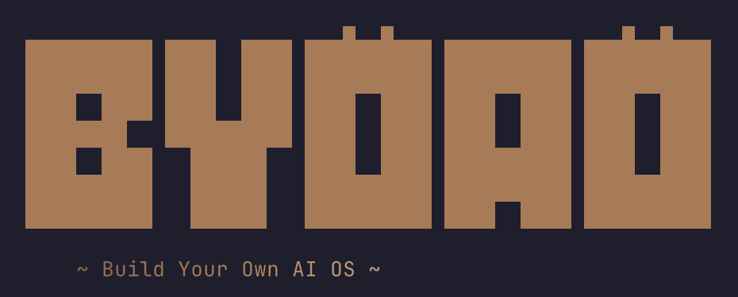

<p align="center">
  
  <br/><br/>
  <em>Turn Obsidian into an AI-powered LLM Wiki knowledge base</em>
  <br/><br/>
  <a href="https://www.npmjs.com/package/@jayjiang/byoao"></a>
  <a href="https://github.com/JayJiangCT/BYOAO/blob/main/LICENSE"></a>
</p>

---

## What is BYOAO?

BYOAO is an [OpenCode](https://opencode.ai) plugin that turns [Obsidian](https://obsidian.md) into an AI-powered LLM Wiki. Write notes freely, then let AI compile structured knowledge — entities, concepts, comparisons, and answers — from your scattered files.

- **Local-first** — your data stays on your machine
- **AI-native** — `AGENTS.md` lets AI agents navigate your knowledge base without RAG
- **Brownfield** — installs alongside your existing notes, no migration needed. Run `/cook` to compile knowledge.

> **Inspired by [Andrej Karpathy's LLM Wiki](https://gist.github.com/karpathy/442a6bf555914893e9891c11519de94f)** — the pattern of using LLMs to incrementally build and maintain a persistent, interlinked wiki from raw notes, rather than re-deriving knowledge on every query. BYOAO is an opinionated implementation of this pattern on top of Obsidian + OpenCode.

## Prerequisites

| Requirement | What it is | How to install |
|-------------|-----------|----------------|
| **[Obsidian](https://obsidian.md/)** | Where you write and browse notes | Download from [obsidian.md](https://obsidian.md/) (latest version) |
| **[Node.js](https://nodejs.org/) 18+** | JavaScript runtime (needed to install BYOAO) | Download the **LTS** version from [nodejs.org](https://nodejs.org/). This also installs `npm` (the package manager) automatically |
| **[OpenCode](https://opencode.ai)** | AI engine that runs BYOAO's skills | `npm install -g opencode` or download from [opencode.ai](https://opencode.ai) |

### Recommended: Obsidian Web Clipper

Install **[Obsidian Web Clipper](https://obsidian.md/clipper)** to capture articles, research, and references directly into your vault from any browser. Clipped pages become raw material for `/cook` — the AI compiles them into structured knowledge alongside your own notes.

- Customizable templates auto-apply frontmatter (author, tags, source URL)
- Highlight passages on any web page and save them to Obsidian in one click
- Everything stays local as plain Markdown — no lock-in

> **Never used a terminal before?** On Mac, open **Terminal** (search "Terminal" in Spotlight). On Windows, open **PowerShell**. You only need the terminal for installation — after setup, everything happens inside Obsidian.

**Verify your setup:**
```bash
node --version    # should print v18.x.x or higher
npm --version     # should print a version number (comes with Node.js)
```

## Quick Start

```bash
npm install -g @jayjiang/byoao
byoao install
byoao init
```

Then open in Obsidian, enable CLI, and run `/cook` to compile your notes into knowledge.

**[Read the full guide](https://jayjiangct.github.io/BYOAO/)** | [Guide source](guide/en/index.md)

## What You Get

| Component | Description |
|-----------|-------------|
| `/cook` | Compile notes into structured knowledge — entities, concepts, comparisons, queries |
| `/health` | Audit agent pages for orphans, broken links, stale content, taxonomy drift |
| `/prep` | Enrich frontmatter and cross-references across all notes |
| `/wiki` | Refresh INDEX.base (Bases wiki index) and update AGENTS.md stats |
| `/organize` | Reorganize vault directories safely via Obsidian CLI |
| `/trace` | Track how an idea evolved over time |
| `/connect` | Bridge two seemingly unrelated topics |
| `/ideas` | Generate actionable ideas from your vault |
| `/challenge` | Pressure-test a belief against your own notes |
| `/drift` | Compare stated intentions vs actual behavior |
| `/ask` | Open-ended Q&A against your knowledge base |
| `/mise` | Full vault structural health check |

## Documentation

- **[English Guide](guide/en/index.md)** — Full documentation
- **[Chinese Documentation](guide/zh/index.md)** — Full documentation in Chinese

## Roadmap

- [x] Personal KB with minimal preset (v0.6)
- [x] `/weave` — knowledge graph builder (v0.6)
- [x] Mode A/B init — fresh + existing folder adoption (v0.6)
- [x] `/trace`, `/connect` — thinking tools (v0.7)
- [x] `/ideas`, `/challenge`, `/drift` — proactive intelligence (v0.8)
- [x] LLM Wiki v2 — `/cook` compilation, `/health` audit, brownfield architecture (v2.0)

## License

MIT
