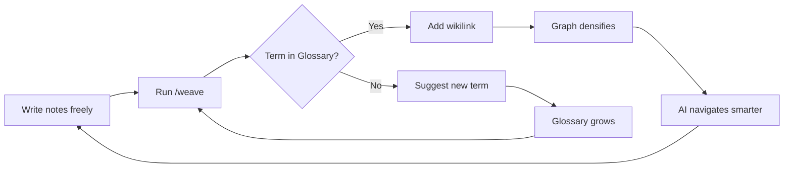

[← Back to Index](index.md) | [中文](../zh/core-concepts.md)

# Core Concepts

How BYOAO turns scattered notes into a navigable knowledge graph.

## The Big Picture

BYOAO follows a simple loop:



1. **You write notes** — daily notes, meeting notes, ideas, anything. No rules, no required format.
2. **`/weave` connects them** — scans your notes, adds frontmatter and wikilinks, grows the Glossary.
3. **`AGENT.md` routes AI** — when you ask a question, AI reads AGENT.md to understand your vault's structure and find relevant notes.
4. **Thinking tools extract insights** — `/trace`, `/emerge`, and `/connect` analyze the graph to surface patterns you haven't noticed.
5. **The graph densifies over time** — each /weave run discovers more connections. More notes = richer graph = smarter AI responses.

The key insight: **you don't organize. You write. The AI organizes.**

## AGENT.md — The AI Navigation Index

`AGENT.md` is the entry point for AI agents. When you open an AI conversation in your vault, the system-transform hook automatically injects AGENT.md into the context, giving the AI a map of your knowledge.

It contains:
- **Your name and KB description**
- **Navigation instructions** — "start with Glossary, follow frontmatter, use backlinks"
- **Key Domains** section (auto-updated by /weave)
- **Conventions** — how notes are structured in this vault

AGENT.md uses section markers so /weave can update auto-generated sections without touching your manual edits:

```markdown
<!-- byoao:domains:start -->
## Key Domains
(auto-generated by /weave)
<!-- byoao:domains:end -->
```

Content between markers is tool-owned. Content outside markers is yours.

## The Glossary — Entity Dictionary

The Glossary (`Knowledge/Glossary.md`) is not a reference document you maintain manually. It's a **living entity dictionary** that /weave reads from and writes to.

| Term | Definition | Domain |
|------|-----------|--------|
| **Rate Limiting** | API request throttling mechanism | infrastructure |
| **Sprint Review** | End-of-sprint demo meeting | process |

**How /weave uses it:**
- **Read**: Every Glossary term is an automatic wikilink candidate. If your note mentions "rate limiting" and the Glossary has "Rate Limiting", /weave creates `[[Rate Limiting]]`.
- **Write**: If an entity appears in 5+ files, /weave auto-suggests adding it to the Glossary. For entities in 3–4 files, /weave asks you to verify before adding.
- **Graduate**: If a Glossary term is referenced by 5+ notes, /weave suggests creating a standalone concept note with its own frontmatter and references.

## Frontmatter — Metadata for AI Navigation

/weave adds YAML frontmatter to the top of your notes:

```yaml
---
title: "Payment Migration Status Update"
type: meeting
date: 2026-03-15
domain: data-infrastructure
references:
  - "[[SQL Patterns]]"
  - "[[Payment Migration]]"
tags: [meeting, migration, payments]
status: active
---
```

| Field | Purpose |
|-------|---------|
| `title` | Descriptive note title |
| `date` | YYYY-MM-DD — when the note was created (mandatory, inferred by /weave) |
| `domain` | Knowledge area — AI uses this to find related notes |
| `type` | Note kind (meeting, idea, reference, daily, project, person) |
| `references` | Related notes — AI follows these for deeper context |
| `tags` | Flexible categorization |
| `status` | draft / active / completed / archived |
| `source` | (optional) URL to cloud origin — Confluence, Google Doc, etc. |

These fields enable **progressive disclosure**: AI reads AGENT.md first, then follows domains and references to find exactly what's relevant — no need to search blindly.

## Vault Structure

### Minimal (default)

```
{KB Name}/
├── .obsidian/           # Obsidian config + plugins
├── Daily/               # Daily notes
├── Knowledge/
│   ├── templates/       # Note templates (Cmd+T)
│   └── Glossary.md      # Entity dictionary
├── AGENT.md             # AI navigation index
└── Start Here.md        # Onboarding guide
```

### With PM/TPM Preset

Adds on top of the minimal core:

```
├── Projects/            # One note per active project
├── Sprints/             # Sprint handoff documents
├── People/              # Person notes + team index
└── Knowledge/templates/ # +Feature Doc, Sprint Handoff
```

**The key idea**: Folders are suggestions. The real structure lives in frontmatter and wikilinks. AI navigates by metadata, not folder paths. You can put notes anywhere — /weave will still find and connect them.

## Presets

Presets are optional addons on top of the minimal core:

| Preset | What it adds | When to use |
|--------|-------------|-------------|
| **minimal** (default) | Nothing extra | Personal knowledge base |
| **PM / TPM** | Projects/, Sprints/, Feature Doc + Sprint Handoff templates, Atlassian MCP | Work project tracking |

Choose a preset during `byoao init`, or skip it and add one later with `byoao upgrade --preset pm-tpm`.

## The Navigation Strategy

When AI agents work in your vault, the system-transform hook injects a navigation strategy:

1. **Read Glossary first** — understand the user's domain vocabulary
2. **Search by domain or tags** — find relevant notes
3. **Follow references** — read linked notes for deeper context
4. **Check backlinks** — discover related notes the user didn't mention
5. **Chain**: Glossary → domain notes → references → backlinks → details

This means AI gets smarter about your vault over time — not because it memorizes, but because the graph structure guides it to the right notes.

---

**← Previous:** [Getting Started](getting-started.md) | **Next:** [Workflows](workflows.md) →
