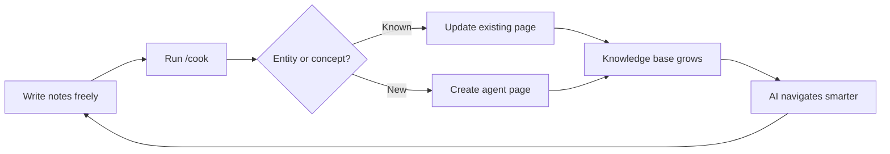

[← Back to Index](index.md) | [中文](../zh/core-concepts.md)

# Core Concepts

How BYOAO turns scattered notes into a navigable LLM Wiki knowledge base.

## The Big Picture

BYOAO follows a simple loop:



1. **You write notes** — daily notes, meeting notes, ideas, anything. No rules, no required format.
2. **`/cook` compiles knowledge** — reads your notes, extracts entities and concepts, creates structured agent pages in `entities/`, `concepts/`, `comparisons/`, and `queries/`.
3. **`AGENTS.md` routes AI** — when you ask a question, AI reads AGENTS.md to understand your vault's structure and find relevant knowledge.
4. **Thinking tools extract insights** — `/trace` and `/connect` analyze the knowledge base to surface patterns you haven't noticed.
5. **The knowledge base grows over time** — each /cook run discovers more connections. More notes = richer knowledge = smarter AI responses.

The key insight: **you don't organize. You write. The AI compiles.**

## The Four Agent Directories

Agent pages are the compiled output of `/cook`. They live in four directories, each with a distinct purpose:

### `entities/` — Named Things

Entities are concrete, identifiable things: people, organizations, products, projects, systems, services, tools.

**When to create:** An entity appears in 2+ notes, or is the central subject of one note.

**Example — `entities/Stripe.md`:**
```yaml
---
title: "Stripe"
type: entity
tags: [vendor, payments]
sources:
  - "Projects/Payment-Migration.md"
  - "Daily/2026-03-20.md"
---
```
```markdown
Stripe is the payment processing platform used for...

## Key Facts
- Contract renewed through 2027
- Primary contact: [[Sarah Chen]]

## Related
- [[Payment Migration]] — ongoing migration project
- [[PCI Compliance]] — relevant compliance framework
```

### `concepts/` — Abstract Ideas

Concepts are methods, rules, decisions, processes, patterns, or principles — things you can't point to but need to reason about.

**When to create:** A concept recurs across notes, or a decision/method deserves its own reference page.

**Example — `concepts/Event Sourcing.md`:**
```yaml
---
title: "Event Sourcing"
type: concept
tags: [architecture, pattern]
sources:
  - "Projects/System-Redesign.md"
  - "Daily/2026-02-14.md"
---
```
```markdown
Event sourcing stores state changes as a sequence of events...

## How We Use It
Applied in the order processing pipeline since Q1 2026...

## Trade-offs
- Pro: Full audit trail, temporal queries
- Con: Increased storage, eventual consistency complexity
```

### `comparisons/` — Side-by-Side Analyses

Comparisons lay out two or more options with criteria, evidence, and a recommendation. Created when `/cook` detects contradictory information about alternatives, or when you explicitly ask for a comparison.

**When to create:** Notes discuss trade-offs between alternatives, or `/cook` finds contradictions about which option is better.

**Example — `comparisons/Kafka vs RabbitMQ.md`:**
```yaml
---
title: "Kafka vs RabbitMQ"
type: comparison
tags: [messaging, infrastructure]
sources:
  - "Projects/Queue-Evaluation.md"
  - "Daily/2026-01-10.md"
contradictions:
  - "Daily/2026-01-10.md says Kafka is overkill; Projects/Queue-Evaluation.md recommends Kafka"
---
```
```markdown
## Criteria
| Criterion | Kafka | RabbitMQ |
|-----------|-------|----------|
| Throughput | Higher | Moderate |
| Complexity | Higher | Lower |
| Team familiarity | Low | High |

## Recommendation
RabbitMQ for current scale. Revisit if throughput exceeds 10K msg/s.
```

### `queries/` — Question-Driven Answers

Queries capture valuable Q&A interactions worth keeping. When you ask the AI a question and the answer synthesizes multiple notes into a useful reference, it becomes a query page.

**When to create:** An answer draws from 3+ sources and would be useful to reference again.

**Example — `queries/How does our auth flow work.md`:**
```yaml
---
title: "How does our auth flow work?"
type: query
tags: [auth, architecture]
sources:
  - "Projects/Auth-Redesign.md"
  - "entities/Okta.md"
  - "Daily/2026-03-05.md"
---
```
```markdown
## Answer
The auth flow uses Okta as the identity provider...

## Sources
Synthesized from [[Auth Redesign]], [[Okta]] entity page, and daily notes.
```

### Choosing the Right Type

| If the subject is... | Use | Example |
|---------------------|-----|---------|
| A person, team, tool, project, or product | `entities/` | Stripe, Sarah Chen, Project Alpha |
| A method, pattern, rule, or decision | `concepts/` | Event Sourcing, PCI Compliance |
| A trade-off between options | `comparisons/` | Kafka vs RabbitMQ |
| A question with a synthesized answer | `queries/` | "How does our auth flow work?" |

## Contradiction Handling

When `/cook` processes your notes, it may find conflicting information — for example, one note says "we chose Kafka" while another says "RabbitMQ is the winner." Rather than silently picking one version, `/cook`:

1. **Detects the contradiction** by comparing facts across sources
2. **Flags it in frontmatter** with a `contradictions` field listing the conflicting sources and dates
3. **Offers to create a comparison page** in `comparisons/` that lays out both sides
4. **Never overwrites** — the older information is preserved alongside the newer

This means your knowledge base reflects reality, including disagreements and evolving decisions.

## log.md — Activity Log

`log.md` records every action the agent takes: pages created, pages updated, contradictions found, health issues detected. Each entry has a timestamp and a one-line summary.

```markdown
## 2026-04-09

- **Created** entities/Stripe.md — extracted from 3 notes
- **Updated** concepts/Event Sourcing.md — added trade-offs section from Daily/2026-04-08.md
- **Contradiction** found between Daily/2026-03-20.md and Projects/Queue-Evaluation.md — created comparisons/Kafka vs RabbitMQ.md

## 2026-04-08

- **Created** 2 entity pages, 1 concept page
- **/health** flagged 1 orphan page, 2 broken wikilinks
```

Use `log.md` to understand what the agent has been doing and when. It's especially useful after running `/cook` to see what changed.

## INDEX.base — Knowledge Map

`INDEX.base` is an [Obsidian Base](https://obsidian.md/blog/bases/) file — a structured query view that displays all agent pages in a sortable, filterable table. It provides a bird's-eye view of your entire knowledge base.

**What it shows:**
- All pages in `entities/`, `concepts/`, `comparisons/`, `queries/`
- Columns: title, type, tags, updated date, source count
- Sortable by any column, filterable by type or tags

Open `INDEX.base` in Obsidian to browse, sort, and filter your knowledge pages. Run `/wiki` to regenerate it when the knowledge base grows.

> **Requires the Bases core plugin** — make sure it's enabled in Settings → Core plugins. See the [Getting Started](getting-started.md#core-plugins) setup instructions.

## Brownfield Adoption

BYOAO is designed for brownfield use — you add it to an existing Obsidian vault or notes folder without disrupting anything:

- **Your existing notes stay untouched.** `/cook` reads them but never modifies them.
- **Your Obsidian config is preserved.** If `.obsidian/` already exists, BYOAO won't overwrite your plugins, themes, hotkeys, or settings.
- **Agent directories are additive.** `entities/`, `concepts/`, `comparisons/`, `queries/` are new folders added alongside whatever structure you already have.
- **No migration needed.** You don't need to move, rename, or reformat your existing notes. Put them anywhere — `/cook` scans the entire vault.

To adopt an existing folder:

```bash
byoao init --from ~/Documents/my-existing-notes
```

To upgrade from BYOAO v1 (Zettelkasten model) to v2 (LLM Wiki model):

```bash
byoao upgrade
```

This adds the v2 agent directories, `SCHEMA.md`, and `log.md` while preserving everything from v1.

## AGENTS.md — The AI Navigation Index

`AGENTS.md` is the entry point for AI agents. When you open an AI conversation in your vault, OpenCode natively loads AGENTS.md as rules, giving the AI a map of your knowledge.

It contains:
- **Your name and KB description**
- **Navigation instructions** — "start with SCHEMA.md, follow frontmatter, use backlinks"
- **Key Domains** section (auto-updated by /wiki)
- **Conventions** — how notes are structured in this vault

AGENTS.md uses section markers so /wiki can update auto-generated sections without touching your manual edits:

```markdown
<!-- byoao:domains:start -->
## Key Domains
(auto-generated by /wiki)
<!-- byoao:domains:end -->
```

Content between markers is tool-owned. Content outside markers is yours.

## SCHEMA.md — Tag Taxonomy and Conventions

`SCHEMA.md` defines the rules for your LLM Wiki: tag taxonomy, naming conventions, page thresholds, and frontmatter requirements. It replaces the v1 Glossary.

**What it contains:**
- **Domain** — what this wiki covers
- **Tag Taxonomy** — 10-20 top-level tags, defined here before use
- **Conventions** — file naming, frontmatter requirements, wikilink rules
- **Page Thresholds** — when to create, split, or archive pages
- **Update Policy** — how contradictions are handled

**How /cook uses it:**
- **Read**: SCHEMA.md defines valid tags and page types. /cook creates pages that conform to these conventions.
- **Write**: When /cook encounters new domains or recurring concepts that need new tags, it updates SCHEMA.md's taxonomy.
- **Enforce**: /health checks all agent pages against SCHEMA.md conventions and flags violations.

## Frontmatter — Metadata for AI Navigation

Agent pages have YAML frontmatter at the top:

```yaml
---
title: "Payment Migration"
created: 2026-03-15
updated: 2026-04-09
type: entity
tags: [project, migration, payments]
sources:
  - "Projects/Feature-A-PRD.md"
  - "Daily/2026-03-15.md"
domain: data-infrastructure
---
```

| Field | Purpose |
|-------|---------|
| `title` | Descriptive page title |
| `created` | YYYY-MM-DD — when the page was first created |
| `updated` | YYYY-MM-DD — bumped on every edit |
| `type` | Page kind: entity, concept, comparison, or query |
| `tags` | From SCHEMA.md taxonomy, 2-5 tags |
| `sources` | Paths to user notes that contributed to this page |
| `domain` | (optional) Knowledge area for filtering |
| `related` | (optional) Explicit cross-references — wikilinks or URLs |
| `contradictions` | (optional) Flagged conflicts with other pages |
| `status` | (optional) draft / reviewed / archived |

These fields enable **progressive disclosure**: AI reads AGENTS.md first, then follows domains and references to find exactly what's relevant — no need to search blindly.

## Vault Structure

### Minimal (default)

```
{KB Name}/
├── .obsidian/           # Obsidian config + plugins
├── (your existing notes) # Untouched — this is the raw layer
├── entities/            # Agent-compiled: people, orgs, projects
├── concepts/            # Agent-compiled: methods, rules, decisions
├── comparisons/         # Agent-compiled: side-by-side analyses
├── queries/             # Agent-compiled: valuable Q&A
├── SCHEMA.md            # Tag taxonomy and conventions
├── INDEX.base           # Knowledge map (Obsidian Base view)
├── log.md               # Action log
├── AGENTS.md            # AI navigation index
└── Start Here.md        # Onboarding guide
```

### With PM/TPM Preset

Adds on top of the minimal core:

```
├── Atlassian MCP        # Remote SSE connection
├── BigQuery MCP         # Local npx connection
└── Agent Client plugin  # Obsidian plugin via BRAT
```

**The key idea**: Your notes are the raw material. The agent compiles structured knowledge in the 4 agent directories. AI navigates by frontmatter metadata, not folder paths. You can put notes anywhere — /cook will still find and compile them.

## Presets

LLM Wiki is the built-in core, not a separate preset. Presets are role overlays:

| Preset | What it adds | When to use |
|--------|-------------|-------------|
| **minimal** (default) | No extra services | Personal LLM Wiki knowledge base |
| **PM / TPM** | Atlassian MCP, BigQuery MCP, Agent Client plugin | Work project tracking with external services |

Choose a preset during `byoao init`, or skip it and add one later with `byoao upgrade --preset pm-tpm`.

## The Navigation Strategy

When AI agents work in your vault, the system-transform hook injects a navigation strategy:

1. **Read SCHEMA.md first** — understand the domain vocabulary and conventions
2. **Search by domain or tags** — find relevant agent pages
3. **Follow references** — read linked notes for deeper context
4. **Check backlinks** — discover related notes the user didn't mention
5. **Chain**: SCHEMA.md → INDEX.base → agent pages → source notes → details

This means AI gets smarter about your vault over time — not because it memorizes, but because the knowledge base structure guides it to the right pages.

---

**← Previous:** [Getting Started](getting-started.md) | **Next:** [Workflows](workflows.md) →
