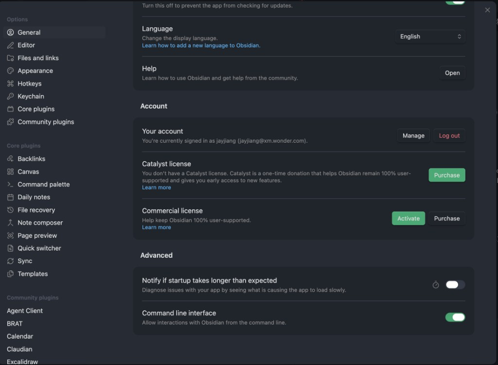
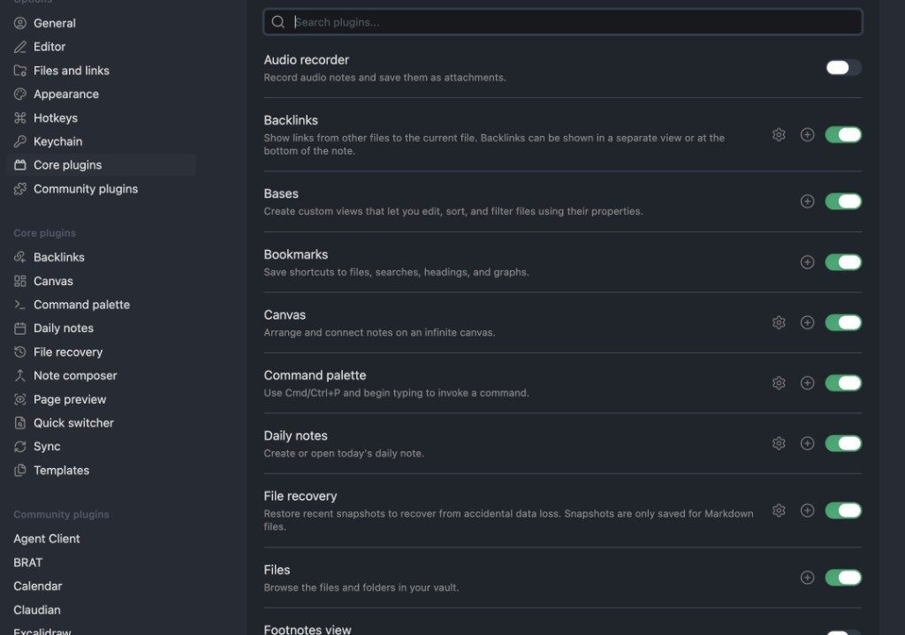
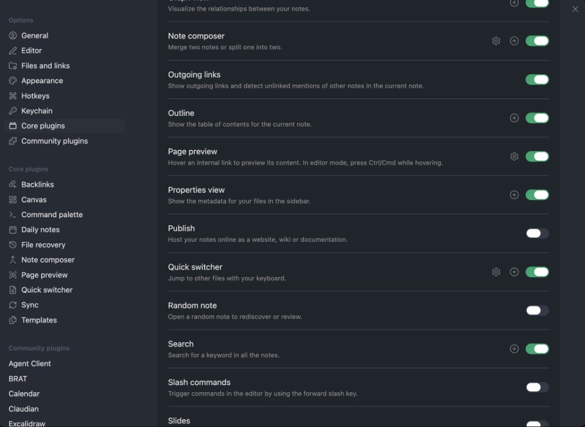
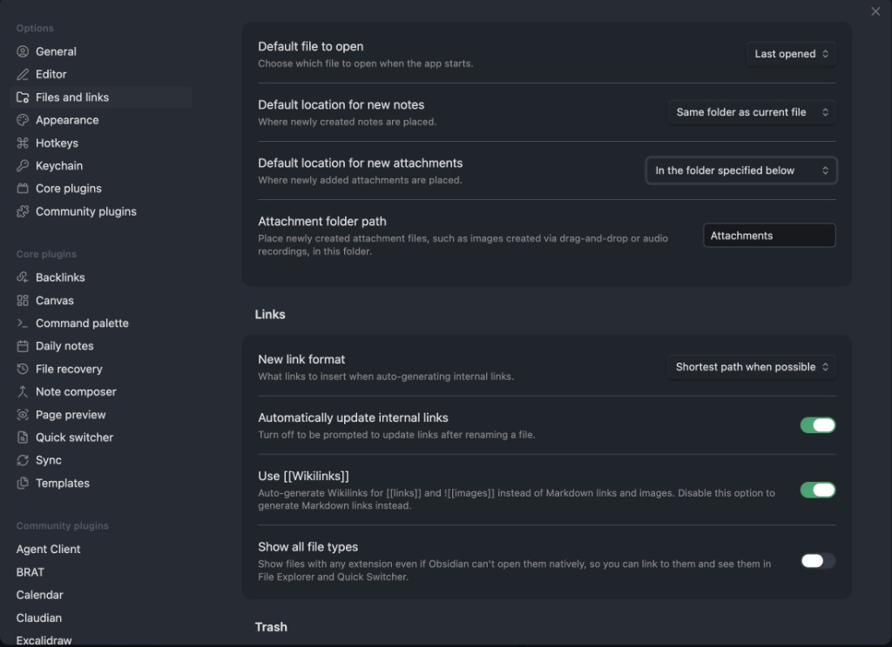

[← Back to Index](index.md) | [中文](../zh/troubleshooting.md)

# Troubleshooting

Common issues and how to fix them.

---

## Obsidian Setup Issues

### Obsidian CLI not available

**Symptom:** /cook or other skills fail with "Obsidian CLI is not available."

**Fix:**
1. Make sure Obsidian is running and your vault is open
2. Go to **Settings** → **General** → scroll to **Advanced** → enable **Command line interface**



3. Verify in your terminal: `obsidian --version`
4. If the command is not found, restart Obsidian and try again

> The CLI toggle only takes effect while Obsidian is running. If you close Obsidian, the CLI becomes unavailable.

---

### INDEX.base doesn't open / shows "Unknown file type"

**Symptom:** Clicking `INDEX.base` in Obsidian does nothing or shows an error.

**Fix:** The **Bases** core plugin must be enabled.

1. Go to **Settings** → **Core plugins**
2. Find **Bases** and enable it



---

### Agent read INDEX.base but still can't list pages

**Symptom:** You (or your AI agent) ran `obsidian read file="INDEX.base"` and expected note titles in the output, but you see YAML/views/filters instead.

**Why:** `INDEX.base` is an **Obsidian Bases** index file. On disk it holds the **definition** Obsidian evaluates into a live table (with paths, tags, dates, backlinks, etc.). The CLI `read` command returns that definition, not the rendered rows.

**Fix:**

1. Treat **`INDEX.base`** as the canonical wiki index: parse it for path and property scope, then run **`obsidian properties`** (e.g. by `type=entity` / `concept` / `comparison` / `query`), **`obsidian search`**, **`obsidian tags`**, and **`obsidian backlinks`** to list and traverse the same notes the Base shows in Obsidian.
2. Follow the **`/ask`** skill end-to-end — it encodes this Bases + CLI workflow.
3. Run **`/wiki`** when the Base query, views, or columns need to match your growing knowledge map.

---

### Frontmatter not visible in sidebar

**Symptom:** Agent pages have YAML frontmatter but you can't see the metadata fields in the sidebar.

**Fix:** Enable the **Properties view** core plugin.

1. Go to **Settings** → **Core plugins**
2. Scroll down and enable **Properties view**



Properties view shows `type`, `tags`, `sources`, and other frontmatter fields in a structured sidebar panel.

---

### Images scattered alongside notes

**Symptom:** When you paste or drag images into Obsidian, they land in the same folder as the note instead of a dedicated folder.

**Fix:** Configure the attachment folder:

1. Go to **Settings** → **Files and links**
2. Set **Default location for new attachments** to **"In the folder specified below"**
3. Set **Attachment folder path** to `Attachments`



---

### Required core plugins checklist

After opening your vault for the first time, verify these core plugins are enabled in **Settings** → **Core plugins**:

| Plugin | Required for | Default |
|--------|-------------|---------|
| **Backlinks** | Viewing incoming links to agent pages | On |
| **Bases** | Opening `INDEX.base` knowledge map | On |
| **Canvas** | Canvas files in the vault | On |
| **Command palette** | `Cmd+P` command access | On |
| **Properties view** | Viewing frontmatter in sidebar | On |

If any are disabled, toggle them on. No restart required.

---

## Agent Client Issues

### Agent Client stuck on "Connecting to OpenCode..."

**Symptom:** The Agent Client panel in Obsidian shows "Connecting to OpenCode..." and never connects.

**Fix:**
1. Press `Cmd+P` → type "Reload app without saving" → Enter
2. Reopen the Agent Client panel
3. If still stuck, close Obsidian completely and reopen it
4. Verify OpenCode works from the vault directory: `cd /path/to/vault && opencode acp`
5. If you see a config error, check `~/.config/opencode/opencode.json` for invalid entries

---

### Obsidian plugins not appearing

**Symptom:** Agent Client or BRAT don't show up after `byoao init`.

**Fix:**
1. When opening the vault for the first time, click **"Trust author and enable plugins"**
2. Go to **Settings** → **Community plugins** and verify they are enabled
3. If Obsidian was running during `byoao init`, restart it or use **Cmd+P** → "Reload app without saving"

---

### Plugin not loading in OpenCode

**Symptom:** BYOAO tools don't appear in OpenCode sessions.

**Fix:**
1. Check that BYOAO is registered: look for `"byoao"` in `.opencode.json` (project-level) or `~/.config/opencode/opencode.json` (global)
2. Re-run `byoao install` to re-register
3. Restart OpenCode after installing

---

## Knowledge Base Issues

### /cook doesn't find my notes

**Possible reasons:**

- **Files are excluded:** /cook skips `.obsidian/`, `.git/`, `node_modules/`, agent directories, AGENTS.md, and binary files
- **Wrong vault:** Make sure the correct vault is open in Obsidian
- **Non-markdown files:** /cook only processes `.md` files. PDFs, images, and other files are skipped
- **Already processed:** In incremental mode, /cook only processes notes modified since the last run. Use `/cook --all` to re-read everything

---

### AGENTS.md looks wrong or has missing sections

**What `byoao upgrade` actually does:** It syncs packaged infrastructure (for example `.opencode/skills/`) when your vault’s recorded BYOAO version in `.byoao/manifest.json` is **older** than the installed CLI. If both versions already match (e.g. CLI and vault are both 2.0.3), the tool reports the vault as up to date and **does not change vault files**.

**Important:** `byoao upgrade` does **not** overwrite vault-root **`AGENTS.md`** or **`SCHEMA.md`**. Those files are generated once at **`byoao init`** from the package templates; afterward they are yours so custom edits and taxonomy are not wiped.

**Global vs vault skills:** `byoao install -g` installs skills under `~/.config/opencode/skills`. `byoao init` also copies skills into `{vault}/.opencode/skills`. After you upgrade the npm CLI, run **`byoao upgrade`** from the vault root: it updates the vault copy when needed, and **whenever `~/.config/opencode/skills` already exists** it refreshes that directory from the current package—even if the vault reports “already up to date” (same manifest version as the CLI). Use **`byoao upgrade --force`** to re-copy vault skills too.

**Easiest — `byoao sync-docs`:** From the vault root, run `byoao sync-docs` (use `--dry-run` to preview). It inserts packaged sections such as **Knowledge Retrieval (Q&A)** in `AGENTS.md` and **Retrieval** in `SCHEMA.md` only when those headings are missing, without replacing whole files. Your `AGENTS.md` must still contain a `## Available Skills` heading so the tool knows where to insert the block.

**Manual merge:** Copy sections from the templates in the [repository](https://github.com/JayJiangCT/BYOAO) (`byoao/src/assets/presets/common/AGENTS.md.hbs`, `SCHEMA.md.hbs`) or from `node_modules/@jayjiang/byoao/`, then paste into your vault files.

---

### Undoing agent page changes

Agent pages live in `entities/`, `concepts/`, `comparisons/`, and `queries/`. Since /cook never modifies your own notes, you can safely delete any agent page and re-run `/cook` to regenerate it.

To see what changed recently, check `log.md` or run:
```bash
byoao logs
```

---

## Installation Issues

### "command not found: node" or "command not found: npm"

**Symptom:** Terminal says `node` or `npm` is not recognized when you try to install BYOAO.

**Fix:**
1. You need to install Node.js first. Go to [nodejs.org](https://nodejs.org/) and download the **LTS** version
2. Run the installer — it installs both `node` and `npm` together
3. **Close and reopen your terminal** after installation (the terminal needs to refresh its PATH)
4. Verify: `node --version` should print `v18.x.x` or higher

**Still not working after install?**
- **Mac:** Try opening a new Terminal window. If using zsh, run `source ~/.zshrc`
- **Windows:** Close PowerShell completely and reopen it. If still failing, restart your computer

---

### "EACCES permission denied" when running npm install -g

**Symptom:** `npm install -g @jayjiang/byoao` fails with a permission error.

**Fix (Mac/Linux):**
```bash
sudo npm install -g @jayjiang/byoao
```
Enter your computer password when prompted. The `sudo` command runs the install with administrator privileges.

**Fix (Windows):** Right-click PowerShell and select "Run as Administrator", then retry the install command.

**Better long-term fix:** Configure npm to install global packages without sudo:
```bash
mkdir -p ~/.npm-global
npm config set prefix '~/.npm-global'
echo 'export PATH=~/.npm-global/bin:$PATH' >> ~/.zshrc
source ~/.zshrc
```

---

### byoao install says "OpenCode not installed"

**Symptom:** Install warns that OpenCode is not found.

**Fix:**
- Install OpenCode: `npm install -g opencode` or visit [opencode.ai](https://opencode.ai)
- If you just installed it, open a new terminal window (the PATH may not be updated)
- You can still use `byoao init` and `byoao status` without OpenCode — the AI skills just won't be available

---

### byoao init fails

**Common causes:**

- **Path permissions:** Make sure you have write access to the target directory
- **Path already exists as a file:** The vault path must be a directory, not a file
- **Obsidian not installed:** `byoao init` checks for Obsidian first. Install it from [obsidian.md](https://obsidian.md)

---

### "Knowledge/ exists but contains no markdown" (vault diagnosis)

**Symptom:** A health or diagnosis report shows an **info** message that folder `Knowledge/` exists but has no Markdown files, and mentions BYOAO v2.

**Why:** BYOAO v1 used a `Knowledge/` directory; v2 uses the agent folders (`entities/`, `concepts/`, etc.) at the vault root. An empty or unused `Knowledge/` folder is harmless legacy clutter.

**Fix:** If you do not need that folder, you can delete `Knowledge/`. Your v2 notes and `/cook` output are not stored there.

---

## MCP Service Issues

### MCP service connection expired (Atlassian / BigQuery)

**Symptom:** Agent says "Atlassian connection failed" or BigQuery queries return authentication errors.

**Fix:**
1. Click the "..." menu in the Agent Client panel → **Restart agent**
2. A browser window should open for re-authentication
3. For Google services, make sure to select your work account
4. Complete the login, then return to Obsidian
5. Ask the agent to retry your request

If this doesn't work, restart Obsidian completely.

---

### BigQuery: authentication required

**Symptom:** Agent says BigQuery tools are unavailable, or queries fail with authentication errors.

BigQuery authentication happens lazily — the first time you ask the agent to query BigQuery, it will trigger `gcloud auth application-default login` via the `byoao_mcp_auth` tool.

**Fix:**
1. Make sure gcloud CLI is installed: https://cloud.google.com/sdk/docs/install
2. Ask the agent to run a BigQuery query — it should call `byoao_mcp_auth` automatically
3. Complete the Google login in the browser window that opens
4. Click "..." → **Restart agent**, then retry

---

## Checking Error Logs

If something isn't working but you're not sure what went wrong:

```bash
byoao logs
```

This shows recent errors from tools, hooks, and CLI commands. To share logs with the developer:

```bash
byoao logs --export ~/Desktop/byoao-logs.txt
```

The exported file includes your BYOAO version, Node version, and OS. Review it before sharing to make sure it doesn't contain sensitive information.

See [CLI Reference — byoao logs](cli-reference.md#byoao-logs) for all options.

---

## Still Stuck?

- Run `byoao logs --export ~/Desktop/byoao-logs.txt` and attach the file to your report
- Check [GitHub Issues](https://github.com/JayJiangCT/BYOAO/issues) for known problems
- Open a new issue with: BYOAO version (`byoao --version`), Node version (`node --version`), OS, and steps to reproduce

---

**← Previous:** [CLI Reference](cli-reference.md)
