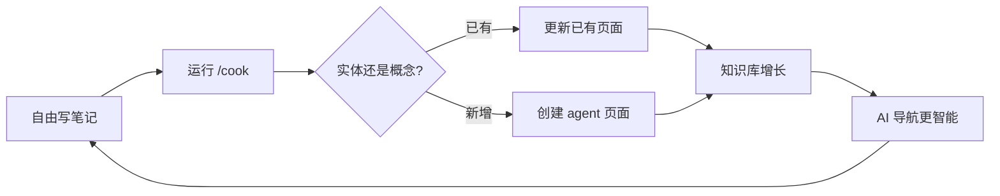

<!-- Translated from en/core-concepts.md | Last synced: 2026-03-29 -->

[← 返回目录](index.md) | [English](../en/core-concepts.md)

# 核心概念

BYOAO 如何将零散笔记转化为可导航的 LLM Wiki 知识库。

## 全局视角

BYOAO 遵循一个简单的循环：



1. **你写笔记** — 日记、会议记录、想法，任何内容。没有规则，不要求固定格式。
2. **`/cook` 编译知识** — 读取你的笔记，提取实体和概念，在 `entities/`、`concepts/`、`comparisons/` 和 `queries/` 中创建结构化 agent 页面。
3. **`AGENTS.md` 引导 AI** — 当你提问时，AI 读取 AGENTS.md 来理解知识库结构，找到相关知识。
4. **思维工具提取洞察** — `/trace` 和 `/connect` 分析知识库，发现你未注意到的模式。
5. **知识库随时间增长** — 每次 /cook 运行发现更多连接。笔记越多 = 知识越丰富 = AI 回答越智能。

核心理念：**你不需要整理。你只管写。AI 来编译。**

## 四个 Agent 目录

Agent 页面是 `/cook` 的编译输出，存放在四个目录中，各有不同的用途：

### `entities/` — 具体事物

实体是具体的、可识别的事物：人物、组织、产品、项目、系统、服务、工具。

**何时创建：** 某个实体在 2+ 篇笔记中出现，或者是某篇笔记的核心主题。

**示例 — `entities/Stripe.md`：**
```yaml
---
title: "Stripe"
type: entity
tags: [vendor, payments]
sources:
  - "Projects/Payment-Migration.md"
  - "Daily/2026-03-20.md"
---
```
```markdown
Stripe is the payment processing platform used for...

## Key Facts
- Contract renewed through 2027
- Primary contact: [[Sarah Chen]]

## Related
- [[Payment Migration]] — ongoing migration project
- [[PCI Compliance]] — relevant compliance framework
```

### `concepts/` — 抽象概念

概念是方法、规则、决策、流程、模式或原则 — 你无法指着看到但需要推理的事物。

**何时创建：** 某个概念在多篇笔记中反复出现，或者某个决策/方法值得单独建一个参考页面。

**示例 — `concepts/Event Sourcing.md`：**
```yaml
---
title: "Event Sourcing"
type: concept
tags: [architecture, pattern]
sources:
  - "Projects/System-Redesign.md"
  - "Daily/2026-02-14.md"
---
```
```markdown
Event sourcing stores state changes as a sequence of events...

## How We Use It
Applied in the order processing pipeline since Q1 2026...

## Trade-offs
- Pro: Full audit trail, temporal queries
- Con: Increased storage, eventual consistency complexity
```

### `comparisons/` — 并列分析

比较页面列出两个或多个选项的标准、证据和建议。当 `/cook` 检测到关于替代方案的矛盾信息，或者你明确要求比较时创建。

**何时创建：** 笔记中讨论了替代方案之间的取舍，或 `/cook` 发现了关于哪个选项更好的矛盾。

**示例 — `comparisons/Kafka vs RabbitMQ.md`：**
```yaml
---
title: "Kafka vs RabbitMQ"
type: comparison
tags: [messaging, infrastructure]
sources:
  - "Projects/Queue-Evaluation.md"
  - "Daily/2026-01-10.md"
contradictions:
  - "Daily/2026-01-10.md says Kafka is overkill; Projects/Queue-Evaluation.md recommends Kafka"
---
```
```markdown
## Criteria
| Criterion | Kafka | RabbitMQ |
|-----------|-------|----------|
| Throughput | Higher | Moderate |
| Complexity | Higher | Lower |
| Team familiarity | Low | High |

## Recommendation
RabbitMQ for current scale. Revisit if throughput exceeds 10K msg/s.
```

### `queries/` — 问题驱动的答案

查询页面捕获值得保留的有价值的问答交互。当你向 AI 提问并且答案综合了多篇笔记形成有用的参考时，它就成为一个查询页面。

**何时创建：** 一个答案引用了 3+ 个来源，并且值得再次参考。

**示例 — `queries/How does our auth flow work.md`：**
```yaml
---
title: "How does our auth flow work?"
type: query
tags: [auth, architecture]
sources:
  - "Projects/Auth-Redesign.md"
  - "entities/Okta.md"
  - "Daily/2026-03-05.md"
---
```
```markdown
## Answer
The auth flow uses Okta as the identity provider...

## Sources
Synthesized from [[Auth Redesign]], [[Okta]] entity page, and daily notes.
```

### 如何选择正确的类型

| 如果主题是... | 使用 | 示例 |
|--------------|------|------|
| 人物、团队、工具、项目或产品 | `entities/` | Stripe, Sarah Chen, Project Alpha |
| 方法、模式、规则或决策 | `concepts/` | Event Sourcing, PCI Compliance |
| 选项之间的取舍 | `comparisons/` | Kafka vs RabbitMQ |
| 带有综合答案的问题 | `queries/` | "How does our auth flow work?" |

## 矛盾处理

当 `/cook` 处理你的笔记时，可能会发现冲突信息 —— 例如，一篇笔记说「我们选了 Kafka」，另一篇说「RabbitMQ 胜出」。与其默默选择某个版本，`/cook` 会：

1. **检测矛盾** —— 通过对比不同来源的事实
2. **在 frontmatter 中标记** —— 使用 `contradictions` 字段列出冲突的来源和日期
3. **提议创建比较页面** —— 在 `comparisons/` 中列出双方观点
4. **绝不覆盖** —— 旧信息与新信息并存

这意味着你的知识库反映现实，包括分歧和演变中的决策。

## log.md — 活动日志

`log.md` 记录 agent 的每一个操作：创建的页面、更新的页面、发现的矛盾、检测到的健康问题。每条记录都有时间戳和一行摘要。

```markdown
## 2026-04-09

- **Created** entities/Stripe.md — extracted from 3 notes
- **Updated** concepts/Event Sourcing.md — added trade-offs section from Daily/2026-04-08.md
- **Contradiction** found between Daily/2026-03-20.md and Projects/Queue-Evaluation.md — created comparisons/Kafka vs RabbitMQ.md

## 2026-04-08

- **Created** 2 entity pages, 1 concept page
- **/health** flagged 1 orphan page, 2 broken wikilinks
```

用 `log.md` 来了解 agent 做了什么以及何时做的。在运行 `/cook` 后查看它特别有用。

## INDEX.base — 知识地图

`INDEX.base` 是一个 [Obsidian Base](https://obsidian.md/blog/bases/) 文件 —— 一个结构化查询视图，以可排序、可过滤的表格显示所有 agent 页面。它提供整个知识库的鸟瞰视图。

**它显示什么：**
- `entities/`、`concepts/`、`comparisons/`、`queries/` 中的所有页面
- 列：标题、类型、标签、更新日期、来源数量
- 可按任意列排序，按类型或标签过滤

在 Obsidian 中打开 `INDEX.base` 来浏览、排序和过滤你的知识页面。每一行对应一篇笔记；列可展示 frontmatter（标签、日期、status、domain）、路径、反向链接等 —— 这些元数据让 Bases 成为关联能力很强的 **索引**。知识库增长后运行 **`/wiki`** 检查或调整 Base 的查询与视图。

**CLI 与 AI：** `obsidian read file="INDEX.base"` 返回磁盘上的 **Base 定义**；Obsidian 在应用里将其求值为实时表格。Agent 使用 **`obsidian properties`**、**`obsidian search`**、**`obsidian tags`**、**`obsidian backlinks`** 等命令查询 **同一批** 笔记与元数据（见 **`/ask`**）。默认不需要再维护单独的静态 markdown 目录文件。

> **需要 Bases 核心插件** —— 确保在 设置 → Core plugins 中已启用。参见[快速上手](getting-started.md#core-plugins)中的设置说明。

### 参考 `INDEX.base` 布局

仓库提供 **[`byoao/src/assets/presets/common/INDEX.base.example`](https://github.com/JayJiangCT/BYOAO/blob/main/byoao/src/assets/presets/common/INDEX.base.example)**（发布后的 npm 包中位于 `presets/common/`）。**`byoao init`** 与 **`byoao upgrade`** 会在缺少该文件时将其复制为库根 **`INDEX.base`**。在 Obsidian 中打开 **`INDEX.base`**。模板包含：四个 agent 目录的**全局** `or` 范围、**公式**（`type_label`、距 `updated` 的天数、反向链接数量）、**`properties.displayName`**（含 **`file.name` → Name**）、可选 **`summaries`**，以及 **六个视图**（按 `type` 分组的 All Pages、按 `domain` 分组的 Entities/Concepts、Comparisons、Queries、Recently Updated 仅用 **`limit`**，勿对原始 **`updated`** 做 `groupBy`）。**`/wiki`** 说明同一套模式；若与你本机 Bases 版本语法略有差异，可在 UI 中微调。

#### Bases YAML：函数从哪来？

过滤条件与公式使用 **Obsidian Bases** 表达式语法（如 `file.inFolder("entities")`、`file.backlinks.length`、`date(updated)`、`today()`）。完整结构、过滤运算符、公式与视图选项见 BYOAO 自带的 **obsidian-bases** 技能（`byoao/src/assets/obsidian-skills/obsidian-bases.md`）及 [Obsidian Bases 介绍](https://obsidian.md/blog/bases/)。

#### `obsidian search` 与 Bases 的分工

- **Bases（`INDEX.base`）** — 在**声明的范围**（目录 + 过滤）内做实时表格：适合**浏览**、分组、陈旧度/反向链接列，以及**定义**哪些算「已编译」wiki 页。
- **`obsidian search`（CLI）** — 全文/查询串检索整库：适合**临时关键词**、自然语言问题、以及 **agent 目录之外**的笔记。Agent **两者都用**：先读 **`INDEX.base`** 定范围，再按 **`/ask`** 使用 **`obsidian properties`** / **`search`** / **`tags`** / **`backlinks`**。

#### `domain` 与 `SCHEMA.md`

按 **`domain` 分组**的视图依赖笔记 frontmatter 里的 **`domain`** 字段（见 **`SCHEMA.md` → Domain Taxonomy**）。在 `/cook` 开始使用某 domain 之前或同时，把 domain 写进 **`SCHEMA.md`**，Base 与 CLI 才一致。

## Brownfield 采纳

BYOAO 设计为 brownfield 使用模式 —— 你将它添加到现有的 Obsidian vault 或笔记文件夹中，不会破坏任何东西：

- **你的现有笔记保持不变。** `/cook` 读取它们但绝不修改。
- **你的 Obsidian 配置被保留。** 如果 `.obsidian/` 已存在，BYOAO 不会覆盖你的插件、主题、快捷键或设置。
- **Agent 目录是增量添加的。** `entities/`、`concepts/`、`comparisons/`、`queries/` 是在你已有结构旁边添加的新文件夹。
- **无需迁移。** 你不需要移动、重命名或重新格式化现有笔记。放在任何地方 —— `/cook` 会扫描整个 vault。

采纳现有文件夹：

```bash
byoao init --from ~/Documents/my-existing-notes
```

从 BYOAO v1（Zettelkasten 模型）升级到 v2（LLM Wiki 模型）：

```bash
byoao upgrade
```

这会添加 v2 agent 目录、`SCHEMA.md`、`log.md`，以及在缺失时从模板写入的 **`INDEX.base`**，同时保留 v1 的所有内容。

## AGENTS.md — AI 导航索引

`AGENTS.md` 是 AI 代理的入口。当你在知识库中打开 AI 对话时，OpenCode 原生加载 AGENTS.md 作为 rules，给 AI 一张知识地图。

它包含：
- **你的名字和知识库描述**
- **导航指令** — "从 SCHEMA.md 开始，跟随 frontmatter，使用反向链接"
- **Key Domains** 区域（由 /wiki 自动更新）
- **Conventions** — 笔记在此知识库中的组织方式

AGENTS.md 使用 section markers，让 /wiki 可以更新自动生成的区域，而不触碰你的手动编辑：

```markdown
<!-- byoao:domains:start -->
## Key Domains
(auto-generated by /wiki)
<!-- byoao:domains:end -->
```

标记之间的内容由工具管理。标记之外的内容属于你。

### 检索协议（问答）

默认库模板在 `AGENTS.md` 中还包含 **Knowledge Retrieval (Q&A)** 小节：**`INDEX.base`** 为 Bases wiki 索引；Agent 读其范围并用 Obsidian CLI 的 **`properties`**、**`search`**、**`tags`**、**`backlinks`** 遍历同一知识图。需要分类或布局规则时读 `SCHEMA.md`，再 `read` 候选笔记并按优先级筛选（agent 目录、tags/domain、`status`、`updated`），最后用 wikilink 引用作答。**`/ask`** 技能是完整、权威的协议。

## SCHEMA.md — 标签分类和约定

`SCHEMA.md` 定义 LLM Wiki 的规则：标签分类、命名约定、页面阈值和 frontmatter 要求。它取代了 v1 的 Glossary。

**它包含什么：**
- **Domain** — 此 wiki 涵盖的领域
- **Tag Taxonomy** — 10-20 个顶级标签，使用前在此定义
- **Conventions** — 文件命名、frontmatter 要求、wikilink 规则
- **Page Thresholds** — 何时创建、拆分或归档页面
- **Update Policy** — 如何处理矛盾

**/cook 如何使用它：**
- **读取**：SCHEMA.md 定义有效标签和页面类型。/cook 创建符合这些约定的页面。
- **写入**：当 /cook 遇到需要新标签的新领域或反复出现的概念时，更新 SCHEMA.md 的分类。
- **强制执行**：/health 检查所有 agent 页面是否符合 SCHEMA.md 约定并标记违规。

## Frontmatter — AI 导航的元数据

Agent 页面顶部有 YAML frontmatter：

```yaml
---
title: "支付迁移"
created: 2026-03-15
updated: 2026-04-09
type: entity
tags: [project, migration, payments]
sources:
  - "Projects/Feature-A-PRD.md"
  - "Daily/2026-03-15.md"
domain: data-infrastructure
---
```

| 字段 | 用途 |
|------|------|
| `title` | 描述性页面标题 |
| `created` | YYYY-MM-DD — 页面首次创建时间 |
| `updated` | YYYY-MM-DD — 每次编辑时更新 |
| `type` | 页面类型：entity、concept、comparison 或 query |
| `tags` | 来自 SCHEMA.md 分类，2-5 个标签 |
| `sources` | 贡献到此页面的用户笔记路径 |
| `domain` | （可选）知识领域，用于过滤 |
| `related` | （可选）显式交叉引用 — wikilinks 或 URL |
| `contradictions` | （可选）与其他页面的标记冲突 |
| `status` | （可选）draft / reviewed / archived |

这些字段实现**渐进式信息发现**：AI 先读 AGENTS.md，然后跟随 domain 和 references 找到精确相关的内容 — 无需盲目搜索。

## 知识库结构

### 极简模式（默认）

```
{知识库名}/
├── .obsidian/           # Obsidian 配置 + 插件
├── (你已有的笔记)         # 保持原位 — 这是原始层
├── entities/            # Agent 编译：人物、组织、项目
├── concepts/            # Agent 编译：方法、规则、决策
├── comparisons/         # Agent 编译：并列分析
├── queries/             # Agent 编译：有价值的问答
├── SCHEMA.md            # 标签分类和约定
├── INDEX.base           # 知识地图（Obsidian Bases wiki 索引）
├── log.md               # 操作日志
├── AGENTS.md            # AI 导航索引
└── Start Here.md        # 入门引导
```

### 叠加 PM/TPM 预设

在极简核心基础上添加：

```
├── Atlassian MCP        # 远程 SSE 连接
├── BigQuery MCP         # 本地 npx 连接
└── Agent Client 插件     # 通过 BRAT 安装的 Obsidian 插件
```

**核心理念**：你的笔记是原始材料。Agent 在 4 个 agent 目录中编译结构化知识。AI 通过 frontmatter 元数据导航，而不是文件夹路径。你可以把笔记放在任何地方 — /cook 仍然能找到并编译它们。

## 预设系统

预设是极简核心之上的可选叠加：

| 预设 | 添加内容 | 使用场景 |
|------|---------|---------|
| **minimal**（默认） | 无额外服务 | 个人 LLM Wiki 知识库 |
| **PM / TPM** | Atlassian MCP、BigQuery MCP、Agent Client 插件 | 有外部服务的工作项目跟踪 |

在 `byoao init` 时选择预设，或稍后通过 `byoao upgrade --preset pm-tpm` 添加。

## 导航策略

当 AI 代理在你的知识库中工作时，system-transform hook 注入导航策略：

1. **先读 SCHEMA.md** — 理解领域词汇和约定
2. **按 domain 或 tags 搜索** — 找到相关 agent 页面
3. **跟随 references** — 读取链接的笔记获取更深上下文
4. **查看反向链接** — 发现用户未提及的相关笔记
5. **链式导航**：SCHEMA.md → INDEX.base 范围 + CLI property/search 图 → agent 页面 → 来源笔记 → 细节（见 **`/ask`**）

这意味着 AI 对你的知识库越来越了解 — 不是因为它记忆，而是知识库结构引导它找到正确的页面。

---

**← 上一步：** [快速上手](getting-started.md) | **下一步：** [常见场景](workflows.md) →
