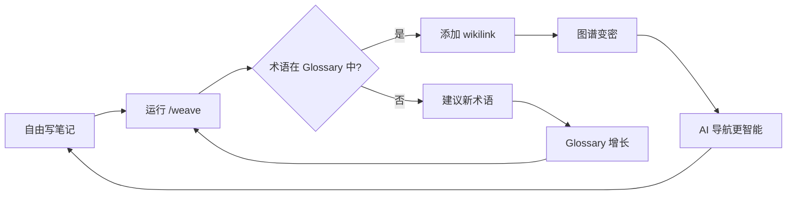

<!-- Translated from en/core-concepts.md | Last synced: 2026-03-29 -->

[← 返回目录](index.md) | [English](../en/core-concepts.md)

# 核心概念

BYOAO 如何将零散笔记转化为可导航的知识图谱。

## 全局视角

BYOAO 遵循一个简单的循环：



1. **你写笔记** — 日记、会议记录、想法，任何内容。没有规则，不要求固定格式。
2. **`/weave` 连接它们** — 扫描笔记，添加 frontmatter 和 wikilinks，维护 Glossary。
3. **`AGENTS.md` 引导 AI** — 当你提问时，AI 读取 AGENTS.md 来理解知识库结构，找到相关笔记。
4. **思维工具提取洞察** — `/trace`、`/emerge`、`/connect` 分析图谱，发现你未注意到的模式。
5. **图谱随时间变密** — 每次 /weave 运行发现更多连接。笔记越多 = 图谱越丰富 = AI 回答越智能。

核心理念：**你不需要整理。你只管写。AI 来整理。**

## AGENTS.md — AI 导航索引

`AGENTS.md` 是 AI 代理的入口。当你在知识库中打开 AI 对话时，OpenCode 原生加载 AGENTS.md 作为 rules，给 AI 一张知识地图。

它包含：
- **你的名字和知识库描述**
- **导航指令** — "从 Glossary 开始，跟随 frontmatter，使用反向链接"
- **Key Domains** 区域（由 /weave 自动更新）
- **Conventions** — 笔记在此知识库中的组织方式

AGENTS.md 使用 section markers，让 /weave 可以更新自动生成的区域，而不触碰你的手动编辑：

```markdown
<!-- byoao:domains:start -->
## Key Domains
(auto-generated by /weave)
<!-- byoao:domains:end -->
```

标记之间的内容由工具管理。标记之外的内容属于你。

## Glossary — 实体字典

Glossary（`Knowledge/Glossary.md`）不是你手动维护的参考文档。它是一个 **活的实体字典**，/weave 从中读取也向其写入。

| Term | Definition | Domain |
|------|-----------|--------|
| **Rate Limiting** | API 请求限流机制 | infrastructure |
| **Sprint Review** | 冲刺末尾的演示会议 | process |

**/weave 如何使用它：**
- **读取**：每个 Glossary 术语都是自动 wikilink 候选。如果你的笔记提到 "rate limiting" 且 Glossary 有 "Rate Limiting"，/weave 会创建 `[[Rate Limiting]]`。
- **写入**：如果一个实体出现在 5+ 个文件中，/weave 自动建议添加到 Glossary。出现在 3–4 个文件中的实体，/weave 会向你确认后再添加。
- **升级**：如果一个 Glossary 术语被 5+ 个笔记引用，/weave 建议创建独立的概念笔记。

## Frontmatter — AI 导航的元数据

/weave 在笔记顶部添加 YAML frontmatter：

```yaml
---
title: "支付迁移状态更新"
type: meeting
date: 2026-03-15
domain: data-infrastructure
references:
  - "[[SQL Patterns]]"
  - "[[支付迁移]]"
tags: [meeting, migration, payments]
status: active
---
```

| 字段 | 用途 |
|------|------|
| `title` | 描述性笔记标题 |
| `date` | YYYY-MM-DD — 笔记创建时间（必填，由 /weave 推断） |
| `domain` | 知识领域 — AI 用它查找相关笔记 |
| `type` | 笔记类型（meeting、idea、reference、daily、project、person） |
| `references` | 相关笔记 — AI 跟随它们获取更深上下文 |
| `tags` | 灵活分类 |
| `status` | draft / active / completed / archived |
| `source` | （可选）云端来源 URL — Confluence、Google Doc 等 |

这些字段实现**渐进式信息发现**：AI 先读 AGENTS.md，然后跟随 domain 和 references 找到精确相关的内容 — 无需盲目搜索。

## 知识库结构

### 极简模式（默认）

```
{知识库名}/
├── .obsidian/           # Obsidian 配置 + 插件
├── Daily/               # 每日笔记
├── Knowledge/
│   ├── templates/       # 笔记模板 (Cmd+T)
│   └── Glossary.md      # 实体字典
├── AGENTS.md            # AI 导航索引
└── Start Here.md        # 入门引导
```

### 叠加 PM/TPM 预设

在极简核心基础上添加：

```
├── Projects/            # 每个活跃项目一个笔记
├── Sprints/             # Sprint 交接文档
├── People/              # 人员笔记 + 团队索引
└── Knowledge/templates/ # +Feature Doc, Sprint Handoff
```

**核心理念**：文件夹是建议。真正的结构在 frontmatter 和 wikilinks 中。AI 通过元数据导航，而不是文件夹路径。你可以把笔记放在任何地方 — /weave 仍然能找到并连接它们。

## 预设系统

预设是极简核心之上的可选叠加：

| 预设 | 添加内容 | 使用场景 |
|------|---------|---------|
| **minimal**（默认） | 无额外内容 | 个人知识库 |
| **PM / TPM** | Projects/、Sprints/、Feature Doc + Sprint Handoff 模板、Atlassian MCP | 工作项目跟踪 |

在 `byoao init` 时选择预设，或稍后通过 `byoao upgrade --preset pm-tpm` 添加。

## 导航策略

当 AI 代理在你的知识库中工作时，system-transform hook 注入导航策略：

1. **先读 Glossary** — 理解用户的领域词汇
2. **按 domain 或 tags 搜索** — 找到相关笔记
3. **跟随 references** — 读取链接的笔记获取更深上下文
4. **查看反向链接** — 发现用户未提及的相关笔记
5. **链式导航**：Glossary → domain 笔记 → references → 反向链接 → 细节

这意味着 AI 对你的知识库越来越了解 — 不是因为它记忆，而是图谱结构引导它找到正确的笔记。

---

**← 上一步：** [快速上手](getting-started.md) | **下一步：** [常见场景](workflows.md) →
